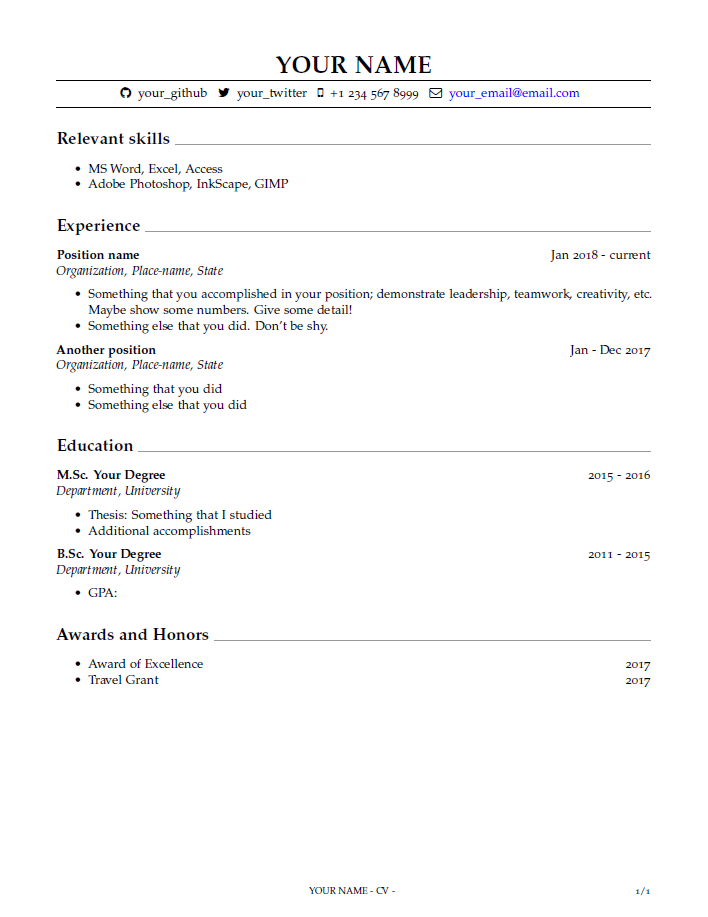

# RMarkdown resume/CV template

Based on templates by [svmiller](https://github.com/svmiller/svm-r-markdown-templates) and [ryanpeek](https://github.com/ryanpeek/markdown_cv). The only two files that are required to run the RMarkdown is `cv-template.Rmd` and `cv-template.tex`, which should be stored in the same directory.

What you write in the fields is completely customizable if you know some Markdown. How you format the document requires LaTeX.

